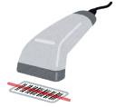

# bacoflea

  

bacoflea is the barcode scanner application. You can get the product name and search it to the flea market easily.

# HOW TO USE

# INSTALL
For now, you can use this application in Android.

Please install this application in play store.

We are developping iOS application, please wait.

# DEVELOPMENT EMVIRONMENT

- flutter v 1.17.5
